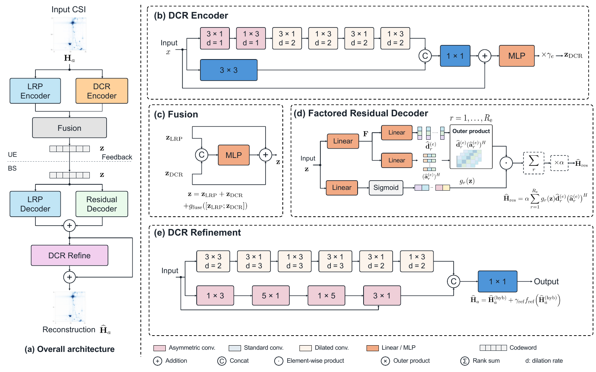
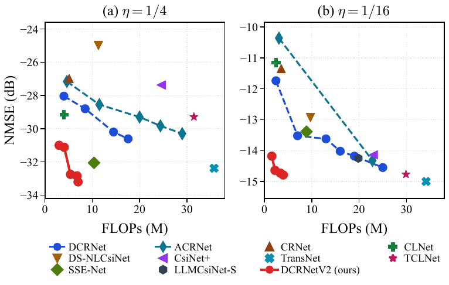

# DCRNetV2: Model-Driven Deep Learning with Rank-One Sensing for Efficient CSI Feedback

PyTorch code and pretrained weights for the LRP and DCRNetV2 CSI feedback models. LRP learns rank-one sensing and reconstruction of the dominant channel components. DCRNetV2 adds gated dilated-convolutional branches to recover the remaining details.



*DCRNetV2 architecture: low-rank sensing, residual encoding, fusion, and reconstruction.*



*Accuracy and computation on COST2100 at compression ratios 1/4 and 1/16.*

Pretrained checkpoints are provided for COST2100 and Sionna-RT-Mix5. See [weights/README.md](weights/README.md) for the available models and loading examples.

## Setup

```bash
git clone https://github.com/tangshunpu/DCRNetV2.git
cd DCRNetV2
python3 -m venv .venv
source .venv/bin/activate
python -m pip install -r requirements.txt
```

Install a suitable PyTorch build for your CUDA version if you plan to use a GPU.

## Data and evaluation

### COST2100

Download the [COST2100 CSI feedback data](https://github.com/tangshunpu/DCRNet#dataset). Pass the directory containing `DATA_Htrain{in,out}.mat`, `DATA_Hval{in,out}.mat`, `DATA_Htest{in,out}.mat`, and `DATA_HtestF{in,out}_all.mat` with `--data`. The loader reads angular-delay CSI from `HT` and full-bandwidth CSI from `HF_all` for the rho metric.

```bash
export COST2100_DATA=/path/to/COST2100
python read_dataset.py --data "$COST2100_DATA" --scenario in
python evaluate.py --data "$COST2100_DATA" --scenario in --variant mini --cr 4
```

`evaluate.py` selects `weights/dcrnetv2-mini/in/cr4.pt` in this example. Use `--checkpoint FILE` to evaluate another checkpoint. The default `--metric paper --batch-size 200` follows the paper's batch-averaged NMSE protocol; `--metric global` computes aggregate NMSE over all samples.

### Sionna-RT-Mix5 / RT-CSI

Download the [RT-CSI release](https://github.com/tangshunpu/RT-CSI). Its `.npz` files contain normalized `x_train`, `x_val`, and `x_test` arrays of shape `(N, 2, 32, 32)`. Pass a file directly to `--data`; no local dataset path is built into the code.

```bash
export RTCSI_DATA=/path/to/RT-CSI-release/data
python read_dataset.py --dataset rtcsi --data "$RTCSI_DATA/csi_combined5_3GHz_32x1024.npz"
python evaluate.py --dataset rtcsi \
  --data "$RTCSI_DATA/csi_etoile_3GHz_32x1024.npz" \
  --variant unified --cr 4
```

The evaluation command selects the Mix5-trained `weights/rtcsi-mix5/dcrnetv2-unified/cr4.pt`. Run it with the Florence, Munich, ZJU, or SUTD archive to evaluate another scene. RT-CSI evaluation reports NMSE; the archives do not contain the `HF_all` data required for rho.

For Shenzhen adaptation, use a few-shot training archive and the separate fixed test archive:

```bash
python train.py --dataset rtcsi \
  --data "$RTCSI_DATA/csi_SHENZHEN_train200_3GHz_32x1024.npz" \
  --test-data "$RTCSI_DATA/csi_SHENZHEN_test_3GHz_32x1024.npz" \
  --variant unified --cr 4 \
  --finetune-from weights/rtcsi-mix5/dcrnetv2-unified/cr4.pt
```

## Training

The paper trains with MSE loss, Adam, batch size 200, initial learning rate `2e-3`, and 1500 epochs. `train.py` uses these as defaults. Validation NMSE selects the best checkpoint; the selected model is evaluated once on the test split. Outputs go to `outputs/checkpoints/` and `outputs/logs/`.

```bash
# COST2100 indoor, compression ratio 1/4
python train.py --data "$COST2100_DATA" --scenario in --variant mini --cr 4

# Five-scene RT-CSI training set, compression ratio 1/4
python train.py --dataset rtcsi \
  --data "$RTCSI_DATA/csi_combined5_3GHz_32x1024.npz" \
  --variant unified --cr 4
```

Use `--variant` to select `mini`, `small`, `base`, `unified`, `large-out`, `large-in4`, or an LRP configuration (`lrp-r4-d128`, `lrp-r4-d512`, `lrp-r8-d512`, `lrp-r16-d512`). `--cr` accepts 4, 8, 16, or 32. Common options are `--epochs`, `--batch-size`, `--lr`, `--workers`, `--gpu`, and `--outputs`; use `--resume FILE` to resume training or `--finetune-from FILE` to initialize a new run from weights. `--gate-reset VALUE` resets the hybrid decoder gate after loading weights. `--test-data FILE` supplies a separate RT-CSI test split.

## Citation

If this code is useful in your research, please cite the [paper](https://arxiv.org/abs/2609.28156):

```bibtex
@misc{tang2026lowrank,
  title={Low-Rank Prior-Guided Rank-One Sensing for Efficient CSI Feedback},
  author={Tang, Shunpu and Yang, Qianqian and Ko, Seung-Woo and Park, Jihong},
  year={2026},
  eprint={2609.28156},
  archivePrefix={arXiv},
  primaryClass={eess.SP},
  url={https://arxiv.org/abs/2609.28156}
}
```

## License

MIT License; see [LICENSE](LICENSE).
